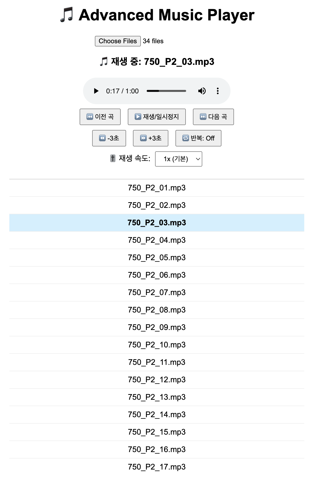

# Music Player

## Function
1) 음성 파일 선택(복수선택 가능)
2) 재생/일시정기
3) 3초 간격 이동(←, → 사용)
4) 반복 재생 설정(L키 사용)
5) 재생 속도 설정(0.5x-2x/0.25간격)
6) 이전/다음 곡 이동(↑, ↓ 사용)
7) 다음곡 자동 재생(반복모드시 같은 곡 재생)
8) 재생목록 스크롤바 제공

## How To Use
- index.html 파일 생성
```
mkdir player
cd player
touch index.html
```
- index.html에 파일 내용 복사하기
- index.html 실행하기

## Result
- reuslt1

